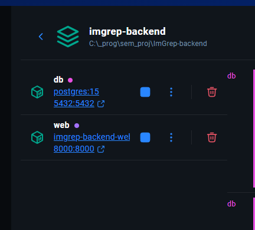

 # Prerequisites
  ###  Windows
 - Windows 10/11 with Docker Desktop and wsl enabled
 - Docker Desktop: [Download](https://www.docker.com/products/docker-desktop/)
    ```bash
    # Test installation
    docker --version
    ```
  ### Linux/Macos
- comming soon


 # Quick Setup

 1. **Create Project**
    ```bash
    git clone <repo>
    cd repo
    ```

 2. **Start Project**
    ```bash
    # Start all services
    docker-compose up --build

    # In another terminal, setup database
    docker-compose exec web python manage.py migrate
    ```

3. **You should get this on your docker desktop**



4. **Test API**
    - Health check: http://localhost:8000/api/health/
    - Test endpoint: http://localhost:8000/api/test/

 # Project Structure
 ```
 imgrep-backend/
 ├── docker-compose.yml     # Docker services config
 ├── Dockerfile            # Python environment setup
 ├── requirements.txt      # Python packages
 ├── .env                 # Environment variables
 ├── manage.py            # Django management
 └── src/
     ├── settings.py      # Django configuration
     ├── urls.py          # Main URL routing
     ├── wsgi.py          # WSGI application
     └── api/
         ├── views.py     # API endpoint logic
         └── urls.py      # API URL routing
 ```

 # Daily Development Workflow

 ### Starting Work
 ```bash
 # Start all services
 docker-compose up

 # Or run in background
 docker-compose up -d
 ```

 ## Making Changes
 1. **Code Changes**
    - Edit files in `src/api/views.py` for API logic
    - Edit files in `src/api/urls.py` for new endpoints
    - Changes are automatically reloaded (no restart needed)

 2. **Database Changes**
    ```bash
    # Create migration after model changes
    docker-compose exec web python manage.py makemigrations

    # Apply migrations
    docker-compose exec web python manage.py migrate
    ```

 3. **Adding New Packages**
    - Add package to requirements.txt
    - Rebuild: `docker-compose up --build`

 ## Testing Changes
 ```bash
 # Test API endpoints
 curl http://localhost:8000/api/health/

 # View logs
 docker-compose logs web

 # Django shell for debugging
 docker-compose exec web python manage.py shell
 ```

 ## Stopping Work
 ```bash
 # Stop services
 docker-compose down

 # Stop and remove all data
 docker-compose down -v
 ```

 ## Common Development Tasks
 ### Add New API Endpoint
 1. Add view function in `src/api/views.py`:
    ```python
    @api_view(['GET'])
    def my_new_endpoint(request):
        return Response({'message': 'Hello from new endpoint'})
    ```
    
 2. Add URL in `src/api/urls.py`:
    ```python
    path('my-endpoint/', views.my_new_endpoint),
    ```
    
 3. Test: http://localhost:8000/api/my-endpoint/

 ### Database Models
 - Create models in new file `src/api/models.py`
 - Add to settings: Add 'src.api' to INSTALLED_APPS (already done)
 - Create migration: `docker-compose exec web python manage.py makemigrations`
 - Apply migration: `docker-compose exec web python manage.py migrate`

 ### Environment Variables
 - Edit `.env` file for configuration
 - Restart services: `docker-compose down && docker-compose up`

 ## API Endpoints
 ### Current Endpoints
 - GET /api/health/ - Health check
 - GET /api/test/ - Test GET request
 - POST /api/test/ - Test POST request

 ### Testing with cURL
 ```bash
 # Health check
 curl http://localhost:8000/api/health/

 # GET test
 curl http://localhost:8000/api/test/

 # POST test
 curl -X POST http://localhost:8000/api/test/ \
   -H "Content-Type: application/json" \
   -d '{"name": "test", "data": "hello world"}'
 ```

 ## Troubleshooting
 ### Common Issues
 ```bash
 # Port already in use
 docker-compose down
 docker-compose up

 # Database connection issues
 docker-compose exec web python manage.py migrate

 # Package not found
 docker-compose up --build

 # Clean restart
 docker-compose down -v
 docker-compose up --build
 ```

 ### Useful Commands
 ```bash
 # View running containers
 docker ps

 # View all logs
 docker-compose logs

 # View specific service logs
 docker-compose logs web
 docker-compose logs db

 # Access container shell
 docker-compose exec web bash

 # Database shell
 docker-compose exec db psql -U postgres -d imagedb
 ```


# File Locations
 ### Add API Logic
 - Views: `src/api/views.py`
 - URLs: `src/api/urls.py`
 - Models: `src/api/models.py` (create if needed)

 ### Configuration
 - Django Settings: `src/settings.py`
 - Database: `docker-compose.yml`
 - Packages: `requirements.txt`

## cheers!!